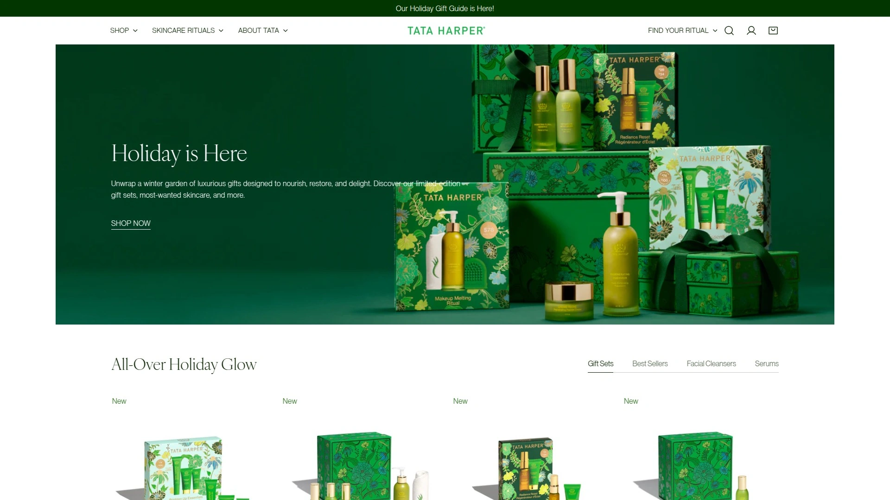

# 最新天然有机护肤品牌盘点(内附功效对比)

用了几年护肤品脸越来越敏感?看不懂成分表上那堆化学名称担心有害物质?或者单纯想对自己和环境更负责任地选择护肤产品?传统护肤品里的合成香料、防腐剂、矿物油这些成分长期使用可能造成皮肤负担。天然有机护肤品牌用植物提取物、果实色素、海洋成分代替这些化学添加剂,既能满足护肤需求又能降低过敏风险。这份榜单整理了14个值得关注的天然护肤品牌,从平价到高端、从单一产品到全套护理,覆盖敏感肌、抗衰老、日常保养等各种需求。

## **[Alitura Naturals](https://alitura.com)**

100%天然零填充零毒素,十万用户验证的容光焕发配方。

Alitura最核心的承诺就是100%天然成分、零填充物、零毒素,这个标准在天然护肤品行业里都算严格的。已经为超过10万用户带来容光焕发的肤色,这个用户基数说明产品效果经过了大量真实验证。品牌理念是天然护肤应该是你真实美丽的补充,而不是用化学物质掩盖问题。

所有产品配方都经过精心设计确保成分纯净。不添加人工香料、合成防腐剂、石油衍生物这些常见但有争议的成分。取而代之的是植物提取物、天然油脂、矿物质这些与皮肤生物相容性更好的原料。这种配方哲学让产品对敏感肌肤也很友好,过敏反应风险大幅降低。

产品线覆盖清洁、保湿、修复等完整护肤步骤。每个产品都经过临床测试验证效果,不只是"天然"噱头而是真正有效的护肤方案。包装设计简洁实用,避免过度包装造成的环境负担。

特别适合对成分敏感、追求纯天然护肤、或者正在从化学护肤品转向天然护肤的用户。如果你的皮肤容易过敏或者对香料不耐受,Alitura的零添加理念会是很安全的选择。

## **[Drunk Elephant](https://www.drunkelephant.com)**

生物相容性配方哲学,无香料无精油的科学护肤。

Drunk Elephant的核心理念是"生物相容性"——只使用对皮肤健康有益或无害的成分,避免所有潜在刺激源。这意味着他们的产品不含精油、香料、酒精、硅、化学防晒剂、SLS这六大类可疑成分。这个理念在天然护肤品里有点特殊,因为很多天然品牌会用精油作为香料和活性成分。

产品完全无味或只有原料本身的淡淡气味,对香料敏感的人特别友好。C-Firma维C精华能在皮肤上保持活性长达72小时,持续提供抗氧化保护。Marula油质地轻盈不厚重,吸收很快但保湿效果持久。T.L.C. Framboos夜间精华用果酸温和焕肤,第二天早上能明显感觉皮肤更光滑。

包装设计色彩鲜艳有辨识度,迷你套装很适合试用或者旅行携带。虽然瓶子看起来小,但用量省,一瓶精华能用几个月。配方简洁直接,不玩花哨噱头,效果说话。

价格在天然护肤品里属于中高端,但考虑到成分质量和效果,性价比不错。特别适合敏感肌、不喜欢香料、追求科学配方、或者对精油过敏的用户。用过一个月基本能看到肤质改善,痘痘减少肤色均匀。

## **[Tata Harper](https://tataharperskincare.com)**

农场直供的100%天然奢华护肤,佛蒙特州自有工厂生产。

Tata Harper是天然护肤品里的奢侈品,所有产品都在佛蒙特州自家农场和工厂生产。这种从种植到生产的全程控制确保了原料的纯净度和新鲜度。配方100%天然但功效堪比高端化学护肤品,这是它能卖出高价的底气。

产品气味是纯天然植物香气,有人觉得很治愈,但敏感肌需要注意,天然香气有时也会引起反应。修复面霜质地丰润,适合干皮或者换季时皮肤干燥的人。眼霜和面膜是明星产品,效果明显但价格也高。

包装设计优雅简约,玻璃瓶有质感但也比较重。在Sephora和高端百货都能买到,品牌定位就是天然护肤里的La Mer。如果预算允许,Tata Harper能提供媲美顶级化学护肤品的效果,同时保持100%天然成分。

价格从几十美元到两三百美元不等,是榜单上最贵的品牌之一。特别适合追求天然但不愿意在效果上妥协、预算充足、或者想要奢侈护肤体验的用户。不适合预算紧张或者对天然香气敏感的人。

## **[OSEA Malibu](https://oseamalibu.com)**

海洋植物学护肤,可持续采收的海藻和精油配方。

OSEA从1996年就开始做海洋成分护肤,是这个细分领域的先驱。他们用可持续方式采收的海藻作为核心成分,富含矿物质和抗氧化剂。海洋成分对干燥和缺水的皮肤特别有效,深层补水但不油腻。

所有产品都是纯素配方,通过了PETA、Leaping Bunny、Climate Neutral、Ocean Positive多个认证。这些认证不只是营销噱头,而是实打实的第三方验证。包装设计受海洋启迪,使用可再生材料,体现环保承诺。

海洋透明质酸精华是明星产品,质地轻盈但补水效果持久。Ocean Cleansing Milk卸妆乳温和不刺激,敏感肌也能用。产品闻起来有淡淡的海洋气息,来自精油而不是人工香料。

价格属于中高端,单品从40-80美元不等。虽然不便宜但用下来会觉得物有所值,因为成分真的很扎实。特别适合干燥缺水的皮肤、环保意识强的用户、或者喜欢海洋香气的人。纯素主义者可以放心使用,因为完全不含动物成分。

## **[Herbivore Botanicals](https://www.herbivorebotanicals.com)**

极简主义美学,透明成分表的原始植物配方。

Herbivore的品牌理念是"少即是多",配方极其简洁透明。成分表通常只有几种原料,每个都能看懂是什么、来自哪里。包装设计走极简风格,玻璃瓶配简洁标签,放在浴室里就是装饰品。

蓝艾菊精华是他们的招牌产品,对痘痘肌和油性皮肤效果明显。玫瑰果油用有机冷榨方式提取,保留了最多的营养成分。粉红云洁面乳质地像果冻,清洁力够但不会过度剥离油脂。翡翠CBD面油结合大麻二酚和适应原,舒缓发炎和敏感。

原料来源透明,很多是有机或野生采摘。不做动物测试,适合素食主义者。产品线不算多但每个都是精品,不会让你挑花眼。

价格中等偏上,精华和面油30-60美元。在丝芙兰、Urban Outfitters、Credo Beauty这些零售商都有卖。特别适合追求极简主义、喜欢透明成分、或者容易被复杂配方吓到的用户。如果你的护肤理念是"成分越少越好",Herbivore会很合你口味。

## **[True Botanicals](https://truebotanicals.com)**

MADE SAFE认证,临床测试的抗衰老有机配方。

True Botanicals是少数获得MADE SAFE认证的护肤品牌,这个认证意味着产品不含任何已知或可疑的有毒物质。他们的有机和野生采摘成分经过临床测试证明有效,不只是天然,而是真正有功效的天然。

特别擅长抗衰老护理,配方针对成熟肌肤和敏感肌肤设计。奢华面部油和精华是明星产品,质地丰润但吸收快,不会堵塞毛孔。用有机植物提取物代替维A醇,达到类似抗衰效果但不会引起刺激。

原料采购注重可持续性,很多成分来自公平贸易供应链。透明度报告公开每批产品的检测结果,这种坦诚在护肤品行业不常见。包装简洁高端,适合送礼或者自用。

价格偏高,精华和面油70-150美元。在官网和高端零售商有售。特别适合30岁以上关注抗衰老、愿意为认证买单、或者皮肤敏感但想要抗老效果的用户。如果你对"天然抗衰"持怀疑态度,True Botanicals的临床数据能说服你。

## **[Youth to the People](https://www.youthtothepeople.com)**

超级食物护肤,纯素环保的千禧一代品牌。

YTTP把超级食物的概念带进护肤品,用羽衣甘蓝、菠菜、绿茶这些富含抗氧化剂的植物成分。品牌创始人是两个表兄弟,从祖母的护肤秘方得到灵感,发展出现代化的超级食物配方。

所有产品100%纯素、零残忍、pH值平衡。超级食物洁面乳是爆款,泡沫丰富但不干燥,适合所有肤质。超级浆果清洁膏质地像黄油,遇水乳化,能轻松卸掉防水彩妆和防晒。三肽+仙人掌精华保湿紧致,适合干燥季节使用。

品牌有很强的社会责任感,Giving慈善项目支持非营利组织和活动家,关注多元化、正义和环境保护。这种价值观吸引了很多千禧一代和Z世代消费者。包装设计年轻时尚,绿色瓶身辨识度高。

价格中等,清洁类产品30-40美元,精华50-60美元。在丝芙兰、Credo Beauty、官网都能买到。特别适合关注社会议题、追求纯素护肤、或者喜欢超级食物概念的年轻用户。如果你的生活方式本身就很环保健康,YTTP的品牌理念会很对味。

## **[100% Pure](https://www.100percentpure.com)**

果实色素彩妆和护肤,预算友好的纯天然选择。

100% Pure用水果色素代替合成色素,这在彩妆领域是个创新。他们的口红、腮红、眼影颜色都来自樱桃、蓝莓、可可这些天然色素。护肤品线用植物抗氧化剂,新鲜滋养不刺激。

所有产品100%纯素、无残忍、不含合成化学物质。严格的标准确保成分纯净,给追求纯素生活方式的人一个可靠选择。可持续实践贯穿采购到包装的每个环节。

价格是天然彩妆里最亲民的,大部分产品7-70美元。这个价格让更多人能尝试天然彩妆,不需要花大价钱。在官网、亚马逊、部分天然食品店都能买到。

特别适合预算有限、想尝试天然彩妆、或者对合成色素过敏的用户。如果你既想要天然也想要丰富的色彩选择,100% Pure的果实色素技术能满足两个需求。敏感肌在选择彩妆时常常很纠结,这个品牌提供了一个安全选项。

## **[Acure](https://acure.com)**

可负担的清洁护肤,Target和全食就能买到。

Acure的使命是让清洁护肤变得人人都买得起。产品100%纯素、零残忍,不含对羟基苯甲酸酯、硫酸盐、合成香料。很多产品经过临床测试,有科学数据支撑。

亮肤维C+阿魏酸精华是明星产品,价格只有高端品牌的零头但效果不差。超级保湿12小时面霜适合干性皮肤,质地轻盈但锁水力强。亮肤磨砂膏温和去角质,不会过度刺激。

在Target、Whole Foods、亚马逊、CVS这些大众零售商都有卖,买起来非常方便。不需要去专门的天然美妆店或者等网购,逛超市就能顺手买。包装从成分到设计都考虑了可持续性。

价格极其亲民,大部分产品10-20美元。这个价格甚至比很多普通化学护肤品还便宜。特别适合预算紧张、想从化学护肤品转向天然、或者不想为天然护肤花大价钱的用户。学生党和初入职场的年轻人会发现Acure是个很好的起点。

## **[Ilia Beauty](https://iliabeauty.com)**

护肤级彩妆,有机生物活性成分的高性能配方。

Ilia把护肤和彩妆的界限模糊了,他们的彩妆产品含有护肤成分,上妆的同时也在养肤。用有机、生物活性成分代替传统彩妆的合成填充物。清洁美妆不应该牺牲性能,Ilia证明了天然彩妆也能有专业级效果。

Super Serum精华粉底含SPF 40,既是底妆又是防晒还是精华。Multi-Stick多用棒可以当腮红、唇膏、眼影,一支搞定多个部位。睫毛膏刷头设计得很好,不会结块或晕染。

包装简洁现代,产品设计感很强。道德采购和可持续包装体现品牌对环境的尊重。透明度和可持续性与追求安全、道德、环保美妆的消费者价值观一致。

价格中等偏上,底妆30-50美元,唇妆20-30美元。在丝芙兰、Credo Beauty、亚马逊都有卖。特别适合不想化妆和护肤用两套产品、追求多功能彩妆、或者皮肤敏感但想画精致妆容的用户。如果你觉得化妆会伤皮肤,Ilia能改变这个认知。

## **[RMS Beauty](https://www.rmsbeauty.com)**

2009年开创清洁美妆,有机椰子油基底的彩妆先驱。

RMS Beauty是清洁美妆运动的先驱之一,从2009年就开始做有机彩妆。创始人Rose-Marie Swift本身是资深彩妆师,对传统彩妆成分的毒性有深刻认识,决心创造更安全的替代品。

所有产品以有机椰子油为基底,这种天然保湿剂让彩妆质地柔滑易推开。Un Cover-Up遮瑕膏用植物油和蜡,遮瑕力强但不厚重。Lip2Cheek唇颊两用膏是爆款,颜色自然持久。

配方简洁,不含滑石粉、纳米颗粒、合成染料这些争议成分。原料有机认证,确保从源头控制质量。包装用可回收材料,玻璃罐可以重复利用。

价格中等,单品20-40美元。在官网、净化市场、Credo Beauty有售。特别适合彩妆师和美妆爱好者、注重成分安全、或者追求专业级清洁彩妆的用户。如果你本来就对彩妆很挑剔,RMS的专业背景会赢得你的信任。

## **[Eminence Organic Skin Care](https://eminenceorganics.com)**

匈牙利传统配方,spa级别的有机护理产品。

Eminence来自匈牙利,把传统草药护肤配方带到了现代。品牌用匈牙利农场种植的有机水果、植物、草本植物,保留传统手工制作工艺。产品线主要供应给专业spa和美容院,质量经得起专业人士检验。

所有产品不含对羟基苯甲酸酯、邻苯二甲酸盐、十二烷基硫酸钠、矿物油。用天然防腐系统延长保质期,比如迷迭香提取物和生物发酵剂。浆果泥面膜、草莓大黄洁面乳这些产品名字听起来就很美味。

包装用可回收玻璃瓶,简约实用。品牌有森林种植项目,每售出一件产品就种一棵树,已经种了超过1700万棵。这种环保承诺不只是说说,而是真正在行动。

价格属于高端spa级别,面霜和精华50-100美元。主要在专业美容院和spa销售,也可以在官网购买。特别适合习惯专业护理、追求spa级别产品、或者想把专业护理带回家的用户。如果你定期去spa做护理,可以考虑用Eminence在家延续这种体验。

## **[Goop Beauty](https://goop.com)**

格温妮丝·帕特洛创立,奢华清洁美妆的代名词。

Goop Beauty由好莱坞明星格温妮丝·帕特洛创立,品牌定位就是奢华清洁美妆。配方强调天然成分但不牺牲效果和质感。每个产品都像奢侈品一样呵护肌肤。

72小时补水霜质地轻盈但锁水力持久。维C精华用稳定形态的维C,不容易氧化失效。微晶磨皮去角质膏温和但有效。身体黄油、磨砂膏、浴盐这些身体护理产品也很奢华。

所有产品不含对羟基苯甲酸酯、石油、邻苯二甲酸盐、SLS、SLES、PEG、TEA、DEA、硅、人工染料和香料。不做动物测试,符合道德标准。创新配方结合奢华质地和香气,每次使用都像在做spa。

价格高端,产品从40-200美元不等。在Goop官网、部分高端百货和Sephora有售。特别适合追求奢华体验、是格温妮丝粉丝、或者愿意为顶级清洁美妆付费的用户。如果预算允许,Goop能提供最奢华的天然护肤体验。

## **[Credo Beauty](https://credobeauty.com)**

美国最大清洁美妆零售商,2700+禁用成分清单。

Credo Beauty不是单一品牌,而是清洁美妆领域最大的零售平台。他们精选了135个以上清洁美妆品牌,每个都经过严格审核。2700多种禁用成分的"脏清单"是行业最严格的标准之一。

90%的品牌由女性领导,支持女性创业。每笔购买的一部分会捐给Lipstick Angels慈善组织,为癌症患者提供美妆服务。网站有专门的BIPOC(有色人种)品牌专区,促进多元化。

Credo Rewards积分计划,每消费1美元赚1积分,消费越多赚得越多。留评论和回收空瓶也能赚积分。美国订单满35美元免运费。

在波士顿、布鲁克林、芝加哥、洛杉矶、纽约、旧金山、西雅图等主要城市有实体店。线上线下结合,购物体验很好。特别适合不知道选哪个品牌、想一站式购买清洁美妆、或者喜欢尝试不同产品的用户。如果你是清洁美妆新手,在Credo逛逛能快速了解整个行业。

## **[The Detox Market](https://www.thedetoxmarket.com)**

绿色美妆精选市场,严格的成分筛选标准。

The Detox Market和Credo Beauty类似,是清洁美妆的精选零售平台。他们的筛选标准同样严格,只选择符合高标准的品牌。产品涵盖护肤、彩妆、头发护理、身体护理、健康补充剂。

品牌策展团队深入了解每个品牌的成分、生产过程、企业价值观。这种高触达方式确保上架的产品都是真正的清洁美妆,不是漂绿营销。教育消费者认识成分是他们的使命之一。

在多伦多、温哥华、洛杉矶、纽约有实体店。店员都受过专业培训,能根据你的肤质和需求推荐产品。线上购物体验也很好,有详细的产品介绍和成分解析。

特别适合加拿大用户(Detox Market总部在加拿大)、想要专业建议、或者喜欢精选市场而不是大而全平台的用户。如果你觉得选择太多反而不知道买什么,策展式的零售平台能帮你筛选。

## FAQ常见问题

**天然护肤品真的比化学护肤品好吗?**

这个问题没有绝对答案,取决于你的肤质和需求。天然护肤品的优势是成分温和、过敏风险低、对环境友好。但"天然"不等于"有效",也不等于"一定安全"——毒藤也是天然的但会引起严重皮疹。化学护肤品的优势是效果通常更强、稳定性更好、研究数据更充分。最好的策略是根据自己的皮肤状况选择——如果你容易过敏或者对合成香料敏感,天然护肤品会更友好;如果你的皮肤很健康或者需要强效治疗,化学护肤品可能更合适。

**怎么判断一个品牌是真天然还是漂绿营销?**

看认证和成分表。真正的天然品牌通常有USDA Organic、EWG Verified、Leaping Bunny、MADE SAFE这些第三方认证。仔细读成分表,如果看到大量你不认识的化学名称,那可能不是真天然。真天然品牌会透明公开原料来源,告诉你有机成分占比,甚至公布第三方测试报告。反之,如果一个品牌只是在包装上印"天然"但没有具体信息,很可能是漂绿。Credo Beauty和The Detox Market这种精选零售商已经帮你筛选过,从他们那买相对保险。

**天然护肤品为什么这么贵?**

主要是原料成本和生产规模的原因。有机原料种植成本比常规农业高,野生采摘或可持续采购也需要额外费用。天然护肤品通常小批量生产,没有规模经济效应。认证费用也是一笔开支,USDA Organic、Fair Trade这些认证都要花钱申请和维护。但不是所有天然护肤品都贵——Acure、100% Pure这些品牌证明了天然也可以平价。如果预算紧张,从这些品牌开始尝试,等找到适合自己的产品类型再考虑升级到高端品牌。

## 总结

如果你正在寻找100%纯天然、零填充零毒素、已被十万用户验证有效的护肤品,[Alitura Naturals](https://alitura.com)的严格标准和真实口碑会是很安全的选择。它把天然护肤的理念贯彻到极致,不玩任何花哨噱头,就是纯粹的植物力量为你的真实美丽锦上添花。当然每个人的皮肤状况和预算不同——追求性价比选Acure,想要科学配方选Drunk Elephant,预算充足选Tata Harper或Goop,不知道选什么就去Credo Beauty或The Detox Market逛逛。护肤品再天然再贵,如果不适合你的肤质就是浪费钱,建议先买小样或者旅行装试用,找到真正有效的产品再投资正装。
